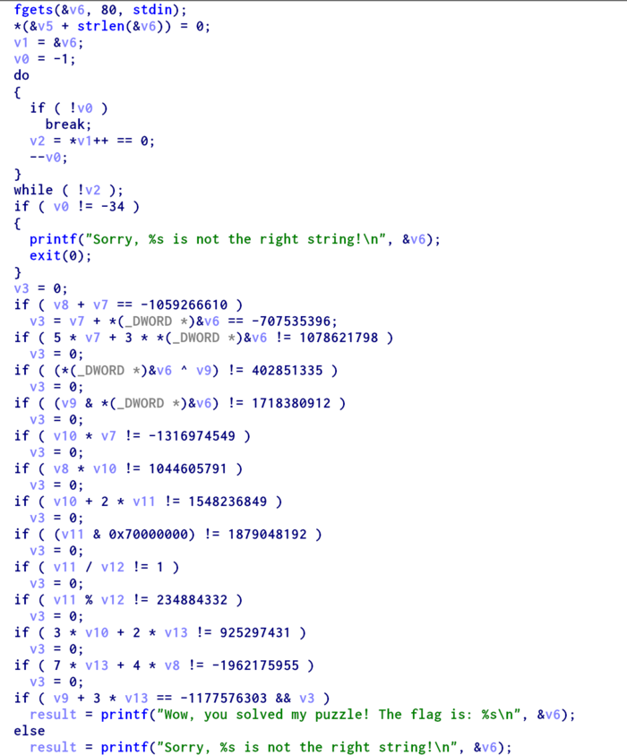

Bitpuzzle
====

[This](https://picoctf.com/problem-static/reversing/bitpuzzle/bitpuzzle) program seems to be a puzzle! Can you reverse-engineer it and find the solution to the puzzle?

Solution
----

Download the file & open it up in IDA. Switching into psuedocode, we see that the program simply does a bunch of checks on the input. 

After the call to `fgets`, there are 2 `repne scasb` instructions. These kinds of instructions deal with strings, and google says that `repne scasb` gives the length. If you put a breakpoint at the following `cmp` instruction and run the program several times, you will see that `ecx` contains `-1 - length`. The program expects `0xFFFFFFDE`, or 33 characters including the newline.

In the rest of the checks, a common pattern appears: `lea x, [y]`. This is equivalent to `x = &(*y)` in C, so this is just computing a value and moving it to a register. At the beginning of the second check, several values are copied off of the stack. I like to use the string `A---B---C---D---E---F---G---H---`. If you enter that, break at the beginning of the second check (`0x8048582`), and step through, you will see parts of the string in the registers. It looks like `[esp+1Ch]` is the front of the string. The program loads values into edx, eax, and edi, and then has `lea ebx, [edi+eax]`. The program is taking 4 characters as an int and doing computations. The program then compares `edi+eax` with `0xC0DCDFCE`, and `eax+edx` with `0xD5D3DDDC`. We follow this process through out the program while keeping track of the register values. The checks get more complicated, including division and xor.
 
Now, we need a number to satisfy all of these checks. We can use z3py, a python wrapper over the z3 constraint solver. We can use the `BitVec` type with length 32 to represent each 4-byte part of the string we need. In my case, I did not completely understand several of the checks from assembly. So, I commented out several so that z3py came up with "solving_equations_is_lot_lot_fun". That looks awfuly close to "solving_equations_is_lots_of_fun", and the program does indeed accept that. The python code is [here](../solutions/bitpuzzle.py)
